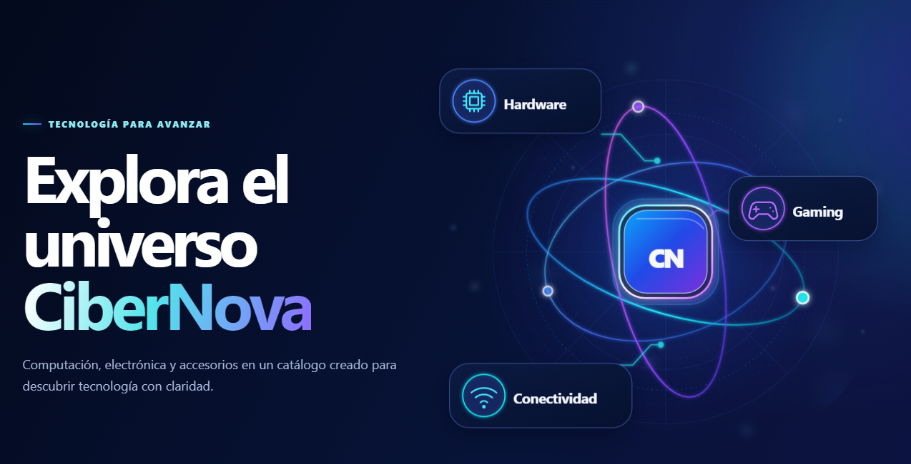

<div align="center">

# CiberNova

### E-Commerce de Tecnología, Computación y Electrónica

**Una experiencia de compra moderna, responsive y orientada a búsqueda, construida con React, TypeScript, Node.js y Algolia.**

<br>


<br>

[Ver sitio desplegado](https://rajami1205.github.io/Proyecto_Comercio_Electronico/) ·
[API de producción](https://cibernova-api.onrender.com) ·
[Repositorio](https://github.com/RaJami1205/Proyecto_Comercio_Electronico)

</div>

---

<div align="center">



</div>

---

## CiberNova

**CiberNova** es una aplicación web de comercio electrónico enfocada en la venta de productos de tecnología, computación y electrónica.

El proyecto fue desarrollado como parte del curso de **Comercio Electrónico** del Tecnológico de Costa Rica y busca ofrecer una experiencia de compra moderna, intuitiva y adaptable a distintos dispositivos.

La plataforma integra un catálogo conectado con **Algolia**, búsqueda predictiva, filtros, paginación, visualización detallada de productos y un sistema completo de carrito de compras.

La arquitectura separa claramente el frontend y backend, manteniendo las credenciales privadas y la comunicación con Algolia fuera del navegador.

---

## Contenido

- [Características principales](#características-principales)
- [Experiencia de compra](#experiencia-de-compra)
- [Tecnologías](#tecnologías)
- [Arquitectura](#arquitectura)
- [Arquitectura del carrito](#arquitectura-del-carrito)
- [Búsqueda y catálogo](#búsqueda-y-catálogo)
- [Diseño responsive](#diseño-responsive)
- [Estructura del proyecto](#estructura-del-proyecto)
- [Requisitos](#requisitos)
- [Clonar el proyecto](#clonar-el-proyecto)
- [Instalación](#instalación)
- [Variables de entorno](#variables-de-entorno)
- [Ejecutar localmente](#ejecutar-localmente)
- [Comandos principales](#comandos-principales)
- [Algolia y dataset](#algolia-y-dataset)
- [Validaciones](#validaciones)
- [Git y flujo de desarrollo](#git-y-flujo-de-desarrollo)
- [Despliegue](#despliegue)
- [Seguridad](#seguridad)
- [Estado actual](#estado-actual)
- [Autores](#autores)
- [Licencia](#licencia)

---

# Características principales

CiberNova incorpora actualmente las principales funcionalidades de un E-Commerce B2C:

### Catálogo

- Catálogo dinámico conectado con Algolia.
- Productos de computación, hardware, gaming, conectividad y electrónica.
- Imágenes, precio, disponibilidad y datos principales por producto.
- Diseño mediante cards reutilizables.
- Paginación adaptada a desktop, tablet y mobile.

### Búsqueda

- Búsqueda dinámica.
- Autocomplete.
- Predictive Search.
- Recent Searches en memoria.
- Resultados sincronizados con el catálogo.
- Limpieza rápida de búsqueda.
- Navegación hacia productos desde sugerencias.

### Filtros

- Categorías.
- Marcas.
- Rangos de precio.
- Navegación jerárquica de categorías.
- Actualización dinámica de resultados.

### Product Quick View

- Vista detallada sin abandonar el catálogo.
- Imagen principal.
- Precio.
- Stock.
- Descripción.
- Especificaciones.
- Acción directa para agregar al carrito.

### Shopping Cart

- Estado global compartido mediante React Context API.
- Gestión de cantidades mediante `useReducer`.
- Agregar productos desde catálogo o Quick View.
- Incrementar y disminuir unidades.
- Eliminación explícita.
- Contador total de unidades.
- Empty State.
- Persistencia del carrito.
- Resumen financiero.
- Diseño responsive.

---

# Experiencia de compra

El flujo principal de usuario es:

```text
Explorar catálogo
      ↓
Buscar / filtrar productos
      ↓
Consultar Product Quick View
      ↓
Agregar al carrito
      ↓
Modificar cantidades
      ↓
Consultar resumen de compra
```

El carrito calcula automáticamente:

```text
Subtotal por producto = Precio × Cantidad

Subtotal general = Σ subtotales

IVA = Subtotal × 13 %

Envío:
  Subtotal <= ₡0           → ₡0
  ₡0 < Subtotal < ₡100000 → ₡3500
  Subtotal >= ₡100000      → ₡0

Total = Subtotal + IVA + Envío
```

La regla de envío gratuito se evalúa utilizando el **subtotal antes del IVA**.

---

# Tecnologías

## Frontend


- React
- TypeScript
- Vite
- CSS Modules
- Fetch API
- Context API
- `useReducer`
- Local Storage
- `Intl.NumberFormat`

---

## Backend


- Node.js
- TypeScript
- Express
- Algolia JavaScript API Client
- CORS
- dotenv

---

## Desarrollo y DevOps


- Git
- GitHub
- npm
- ESLint
- GitHub Actions
- GitHub Pages
- Render
- Visual Studio Code

---

# Arquitectura

CiberNova utiliza una arquitectura separada entre cliente y servidor.

```text
┌──────────────────────┐
│      Navegador       │
│                      │
│ React + TypeScript   │
└──────────┬───────────┘
           │
           │ HTTPS / Fetch API
           ↓
┌──────────────────────┐
│     Express API      │
│                      │
│ Node.js + TypeScript │
└──────────┬───────────┘
           │
           │ Algolia Client
           ↓
┌──────────────────────┐
│       Algolia        │
│                      │
│ Search / Faceting    │
└──────────────────────┘
```

El flujo de datos principal es:

```text
React
  ↓
Hooks / Services
  ↓
Fetch API
  ↓
Express Route
  ↓
Controller
  ↓
Service
  ↓
Algolia
  ↓
Mapper
  ↓
JSON Response
  ↓
React
```

Esta separación evita que el frontend tenga acceso directo a credenciales privadas de Algolia.

---

## Responsabilidades del Client

El directorio `client/` contiene:

- presentación;
- componentes;
- navegación de interfaz;
- estado del catálogo;
- búsqueda;
- filtros;
- paginación;
- estado global del carrito;
- persistencia del carrito;
- cálculos derivados;
- responsive design.

---

## Responsabilidades del Server

El directorio `server/` contiene:

- API Express;
- configuración;
- validación de variables de entorno;
- comunicación con Algolia;
- controllers;
- services;
- mappers;
- procesamiento de categorías;
- manejo de errores;
- herramientas administrativas como el seed de Algolia.

---

# Arquitectura del carrito

El Shopping Cart mantiene una única fuente de verdad para sus productos.

```text
React Components
       ↓
    useCart()
       ↓
  CartContext
       ↓
  CartProvider
       ↓
   useReducer
       ↓
   CartState
```

El estado global mantiene principalmente:

```text
CartState
└── items: CartItem[]
```

Cada `CartItem` utiliza un snapshot mínimo del producto:

```text
CartItem
├── productId
├── name
├── price
├── image
└── quantity
```

Los valores financieros no se almacenan como una segunda fuente de verdad.

Se calculan como `derived state` mediante funciones puras:

```text
CartState.items
      ↓
cartCalculations
      ↓
subtotal
IVA
shipping
total
```

Esto evita inconsistencias entre el carrito y el resumen de compra.

---

## Persistencia del carrito

El carrito utiliza almacenamiento local para conservar los productos entre recargas del navegador.

La persistencia se mantiene separada de la lógica pura del reducer.

Conceptualmente:

```text
CartState
   ↕
cartStorage
   ↕
localStorage
```

La persistencia es exclusiva del carrito.

Funciones como **Predictive Search** y **Recent Searches** continúan siendo temporales y se reinician al recargar la aplicación.

---

# Búsqueda y catálogo

El catálogo utiliza Algolia como motor de búsqueda.

La aplicación permite:

```text
Query
 ↓
Autocomplete
 ↓
Predictive Search
 ↓
Filtros
 ↓
Paginación
 ↓
Resultados
```

Las consultas se realizan mediante el backend:

```text
Client
  ↓
/api/products
  ↓
Express
  ↓
Algolia
```

---

## Recent Searches

Las búsquedas recientes son deliberadamente **memory-only**.

No utilizan:

- `localStorage`
- `sessionStorage`
- IndexedDB
- cookies
- backend persistence

Al recargar o cerrar la aplicación, el historial se reinicia.

---

# Diseño responsive

CiberNova fue diseñada para adaptarse a:

- Desktop
- Tablet
- Mobile

El catálogo utiliza distintas densidades dependiendo del viewport.

| Vista | Columnas | Productos por página |
|---|---:|---:|
| Desktop | 3 | 9 |
| Tablet | 3 | 6 |
| Mobile | 2 | 6 |

El carrito también adapta su composición:

### Desktop / Tablet

```text
┌───────────────────────────────┬────────────────────┐
│ Productos                     │ Resumen de compra  │
│                               │                    │
│ Item                          │ Subtotal           │
│ Item                          │ IVA                │
│ Item                          │ Envío              │
│                               │ Total              │
└───────────────────────────────┴────────────────────┘
```

### Mobile

```text
┌─────────────────────┐
│ Producto            │
├─────────────────────┤
│ Producto            │
├─────────────────────┤
│ Resumen de compra   │
└─────────────────────┘
```

La interfaz utiliza una identidad visual basada en:

- navy oscuro;
- electric blue;
- cyan;
- violeta;
- fondos claros;
- bordes suaves;
- efectos de profundidad y glow controlado.

---

# Estructura del proyecto

```text
E_Commerce/
│
├── .github/
│   └── workflows/
│       └── deployment.yml
│
├── client/
│   ├── src/
│   │   ├── assets/
│   │   ├── components/
│   │   │   ├── cart/
│   │   │   ├── catalog/
│   │   │   └── layout/
│   │   ├── context/
│   │   ├── hooks/
│   │   ├── pages/
│   │   ├── services/
│   │   ├── styles/
│   │   ├── types/
│   │   ├── utils/
│   │   ├── App.tsx
│   │   └── main.tsx
│   │
│   ├── package.json
│   └── vite.config.ts
│
├── server/
│   ├── data/
│   │   └── productos.json
│   │
│   ├── src/
│   │   ├── config/
│   │   ├── controllers/
│   │   ├── mappers/
│   │   ├── routes/
│   │   ├── scripts/
│   │   ├── services/
│   │   ├── types/
│   │   ├── app.ts
│   │   └── index.ts
│   │
│   └── package.json
│
├── docs/
│   └── assets/
│       └── cibernova-panel.png
│
├── AGENTS.md
└── README.md
```

`client/` y `server/` son aplicaciones independientes y administran sus dependencias mediante sus respectivos archivos `package.json`.

---

# Requisitos

Antes de ejecutar el proyecto se requiere:

- Git
- Node.js
- npm
- navegador web moderno
- acceso a Algolia para ejecutar el backend completo

Verificar las herramientas:

```bash
git --version
node --version
npm --version
```

---

# Clonar el proyecto

Repositorio:

```text
https://github.com/RaJami1205/Proyecto_Comercio_Electronico
```

Clonar:

```bash
git clone https://github.com/RaJami1205/Proyecto_Comercio_Electronico.git
```

Ingresar al proyecto:

```bash
cd Proyecto_Comercio_Electronico
```

---

# Instalación

El `client` y el `server` mantienen dependencias independientes.

## Client

```bash
cd client
npm install
```

## Server

Desde la raíz:

```bash
cd server
npm install
```

Para una instalación reproducible utilizando el lockfile también puede utilizarse:

```bash
npm ci
```

---

# Variables de entorno

Los archivos `.env` no deben almacenarse en Git.

---

## Client

Crear:

```text
client/.env
```

Ejemplo para desarrollo local:

```env
VITE_API_BASE_URL=http://localhost:3000
```

En producción, esta variable apunta hacia la API desplegada en Render.

---

## Server

Crear:

```text
server/.env
```

El backend requiere las variables de configuración correspondientes a:

- aplicación de Algolia;
- índice de productos;
- credencial autorizada del servidor;
- puerto de ejecución;
- configuración permitida por el entorno.

Los nombres y validaciones deben mantenerse consistentes con la configuración definida en:

```text
server/src/config/env.ts
```

Las credenciales privadas nunca deben utilizarse directamente desde `client/`.

---

# Ejecutar localmente

Frontend y backend deben ejecutarse en terminales independientes.

---

## 1. Server

```bash
cd server
npm run dev
```

El backend utilizará el puerto configurado para el entorno local.

---

## 2. Client

En otra terminal:

```bash
cd client
npm run dev
```

Vite mostrará la URL local, normalmente:

```text
http://localhost:5173
```

El flujo será:

```text
Browser
   ↓
React / Vite
   ↓
Express API
   ↓
Algolia
```

---

# Comandos principales

## Client

| Comando | Descripción |
|---|---|
| `npm run dev` | Ejecuta Vite en modo desarrollo |
| `npm run lint` | Ejecuta ESLint |
| `npm run build` | Genera el build de producción |
| `npm run preview` | Previsualiza localmente el build |

---

## Server

| Comando | Descripción |
|---|---|
| `npm run dev` | Ejecuta el backend en desarrollo |
| `npm run build` | Compila TypeScript |
| `npm start` | Inicia el backend compilado |
| `npm run seed:algolia` | Ejecuta la herramienta controlada de seed de Algolia |

---

# Algolia y dataset

El catálogo de CiberNova utiliza Algolia como motor de búsqueda y faceting.

El dataset mantenido por el proyecto se encuentra en:

```text
server/data/productos.json
```

El repositorio incluye una herramienta de seed para reproducir la carga de productos hacia Algolia:

```text
server/src/scripts/seedAlgolia.ts
```

La herramienta fue diseñada con protecciones para evitar escrituras accidentales.

El comportamiento predeterminado es de validación / `dry-run`.

La escritura sobre Algolia requiere una acción explícita y credenciales separadas destinadas al seed.

El seed:

- no se ejecuta al iniciar el servidor;
- no forma parte del deployment normal;
- no se ejecuta automáticamente desde Render;
- no modifica settings o replicas del índice de forma implícita.

Debe utilizarse únicamente cuando sea necesario reconstruir o actualizar deliberadamente los productos del índice.

---

# Validaciones

Antes de integrar cambios se deben ejecutar las validaciones correspondientes.

## Client

```bash
cd client
npm run lint
npm run build
```

## Server

```bash
cd server
npm run build
```

Todos los comandos deben finalizar correctamente antes de integrar cambios hacia las ramas principales.

---

# Git y flujo de desarrollo

El proyecto utiliza una estrategia basada en:

```text
main
└── dev
    └── feature/*
```

Flujo habitual:

```text
feature/*
   ↓
Pull Request
   ↓
dev
   ↓
validación
   ↓
Pull Request
   ↓
main
```

### `main`

Representa la versión estable y desplegable.

### `dev`

Representa la rama de integración.

### `feature/*`

Cada funcionalidad o corrección se desarrolla de forma aislada antes de integrarse.

Las integraciones se realizan mediante Pull Requests.

---

# Despliegue

La solución utiliza deployments independientes para frontend y backend.

---

## Frontend — GitHub Pages

El frontend está desplegado mediante:

```text
GitHub Actions
       ↓
npm ci
       ↓
npm run lint
       ↓
npm run build
       ↓
GitHub Pages
```

El workflow se encuentra en:

```text
.github/workflows/deployment.yml
```

Se ejecuta automáticamente cuando existen nuevos cambios en:

```text
main
```

Sitio:

**https://rajami1205.github.io/Proyecto_Comercio_Electronico/**

Cada nuevo deployment actualiza el sitio existente y conserva la misma URL.

---

## Backend — Render

La API Express está desplegada mediante un Web Service de Render.

API:

**https://cibernova-api.onrender.com**

Render está conectado al repositorio y a la rama:

```text
main
```

con:

```text
Auto-Deploy: On Commit
```

Por tanto, los nuevos commits integrados en `main` actualizan automáticamente el backend.

La URL del servicio permanece estable entre deployments.

> El plan gratuito de Render puede suspender temporalmente la instancia después de un periodo de inactividad, por lo que la primera solicitud puede presentar un tiempo de respuesta mayor.

---

## Algolia

Algolia funciona como servicio externo para:

- catálogo;
- búsqueda;
- autocomplete;
- filtros;
- faceting;
- paginación.

El deployment del frontend o backend no ejecuta automáticamente el seed.

---

# Seguridad

El proyecto sigue las siguientes prácticas:

- archivos `.env` excluidos del repositorio;
- credenciales privadas únicamente en backend;
- ninguna API Key administrativa expuesta al navegador;
- comunicación con Algolia centralizada mediante Express;
- validación de variables de entorno;
- CORS configurado para los orígenes permitidos;
- seed de Algolia protegido contra escrituras accidentales;
- variables de producción administradas desde GitHub y Render;
- validación mediante lint y build antes del deployment.

---

# Estado actual

<div align="center">


</div>

El desarrollo correspondiente al **Laboratorio 3** se encuentra completado.

La versión actual incluye:

- catálogo dinámico;
- integración con Algolia;
- búsqueda y autocomplete;
- Predictive Search;
- Recent Searches;
- filtros;
- paginación;
- Product Quick View;
- carrito global;
- agregar productos;
- modificación de cantidades;
- eliminación de productos;
- indicador de unidades;
- Empty State;
- persistencia del carrito;
- subtotal por producto;
- subtotal general;
- IVA del 13%;
- regla de costo de envío;
- envío gratuito desde ₡100 000;
- total de compra;
- responsive design;
- integración Client–Server;
- deployment automatizado.

La arquitectura se desarrolló de forma incremental y mantiene separación clara entre presentación, estado, lógica de negocio, servicios y acceso a datos.

---

# Autores

Proyecto académico desarrollado para el curso de **Comercio Electrónico**.

**Tecnológico de Costa Rica**  
**Escuela de Ingeniería en Computación**

---

# Licencia

Este proyecto fue desarrollado con fines académicos y educativos.

Su contenido se utiliza como parte del proceso de aprendizaje y evaluación del curso de Comercio Electrónico.

---

<div align="center">

### CiberNova

**Tecnología, computación y electrónica en una experiencia de compra moderna.**

React · TypeScript · Vite · Node.js · Express · Algolia

</div>
